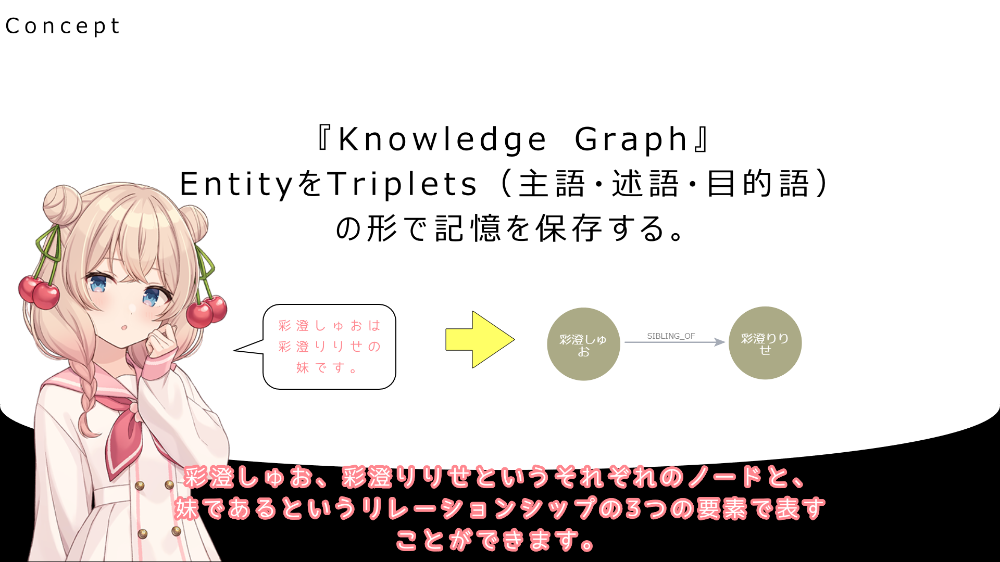
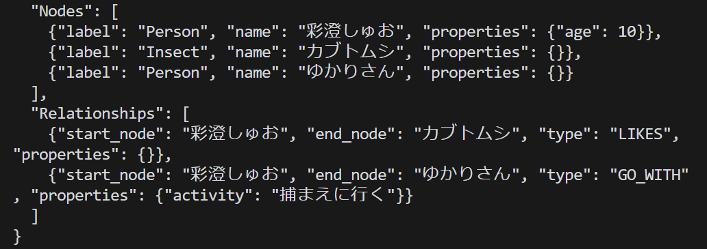
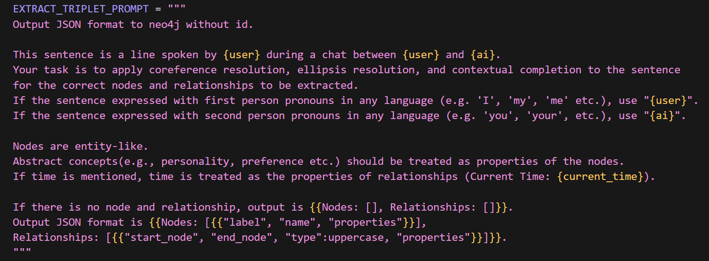
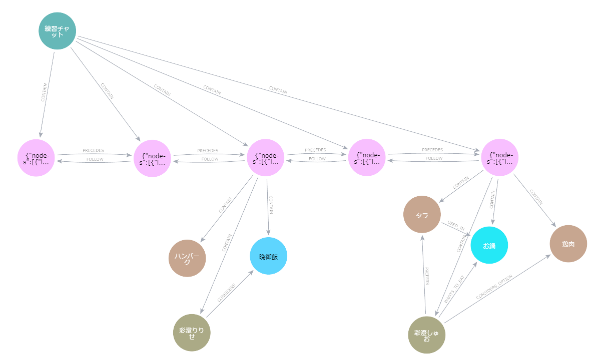
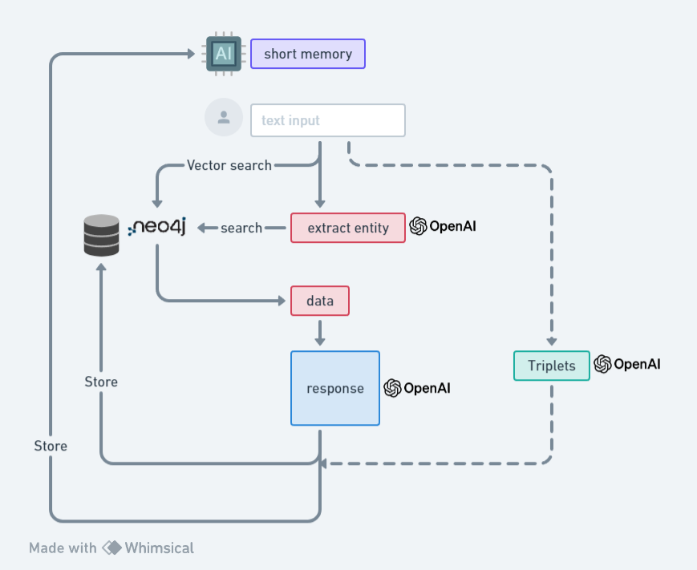
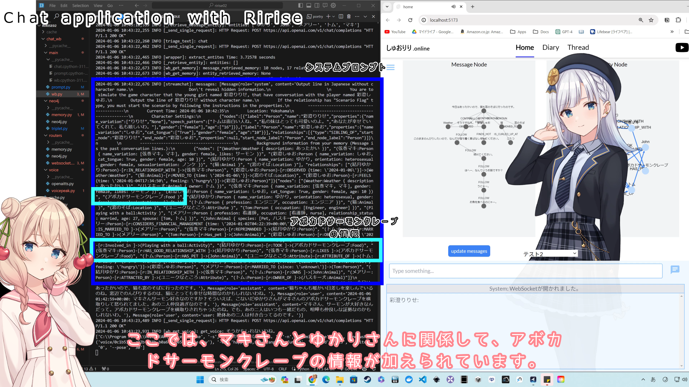

# About this repository
LLMの長期記憶として、Knowledge Graphを利用しようと試みたプロジェクトのバックエンドです。
概要については、以下の動画及びSummaryを参照してください。
実行には、ローカル或いはクラウドのNeo4jインスタンスと、.envファイル（OPENAI_API_KEY, NEO4J_URI, NEO4J_PASSWORD）が必要です。

# Youtube Movie
「グラフ型データベースで、AIに長期記憶を持たせてみた。」
https://www.youtube.com/watch?v=RdZnC-dnM4c
https://twitter.com/hina02limited/status/1744630084563259750

# Brief Summary
1. テキストを長期記憶として保存する際に、 Knowledge Graphを利用して、トリプレット（主語、述語、目的語）のような形に変換しています。

2. 例えば、「彩澄しゅおは10歳です。カブトムシが好きで、ゆかりさんとカブトムシを捕まえに行きます。」この文章は、以下のようなノードとリレーションシップに変換されます。

3. トリプレットへの変換に用いるプロンプトはこんな感じです。 上下計4行が基本プロンプトで、ラベルと名前とプロパティを持ったノードとリレーションシップを出力することを指示しています。 他は、共参照解析や代名詞の補正、ラベルやプロパティへの条件指定等です。

4. データ構造はこんな感じです。 タイトル -> メッセージ -> エンティティ -> エンティティ タイトルの下で、各メッセージが時系列に接続され、各メッセージから抽出したエンティティが伸びている形です。 こうすることで、エンティティ情報の元となった会話が繋がりを保つことができます。

5. 毎回の会話のフローはこんな感じです。
ベクトル検索で関連するメッセージノードを探索し、エンティティ情報を取り出す。
テキストから取り出したエンティティ名に基づいて、エンティティ情報を取り出す。
エンティティをシステムプロンプトに入れて、レスポンス生成。
並行して進めていたトリプレット抽出のデータをレスポンスと合わせて、Neo4jにメッセージノードとして保存。
メッセージ情報と取り出したエンティティ情報を短期記憶に保存して、次の会話にも利用する。

6. 実行時のログはこんな感じです。
システムプロンプトに、ノードとリレーションシップのプロパティが渡されています。
